<h5>Software Engineering Coursework, Second Year of Computer Science</h5>

- Developed library management console system using C++ that manages books.
- Implemented a binary search tree to improve the speed of the library system from _O(n)_ to _O(log n)_ time. 
- Inspired by how software engineering has improved the speed and space of systems.

<u><b>Utilised:</b></u> C++, Catch2, Algorithms and Data Structures, OOP

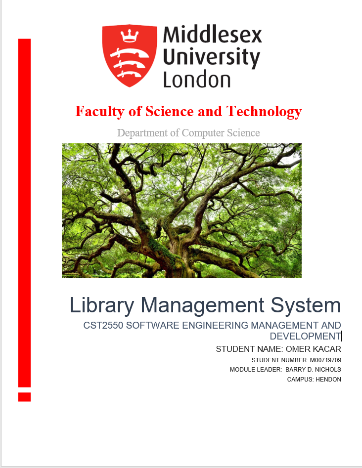
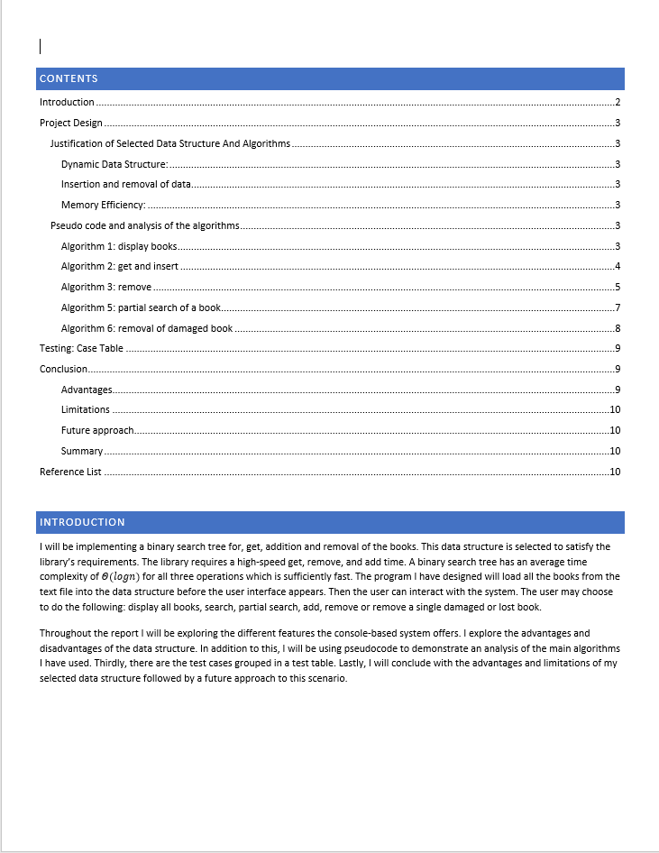
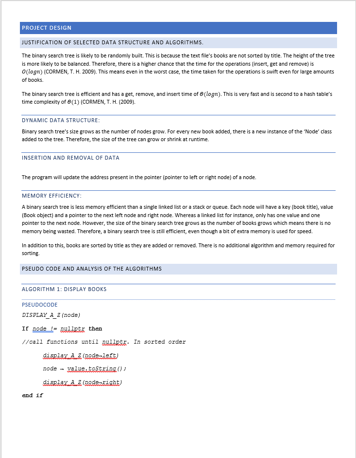
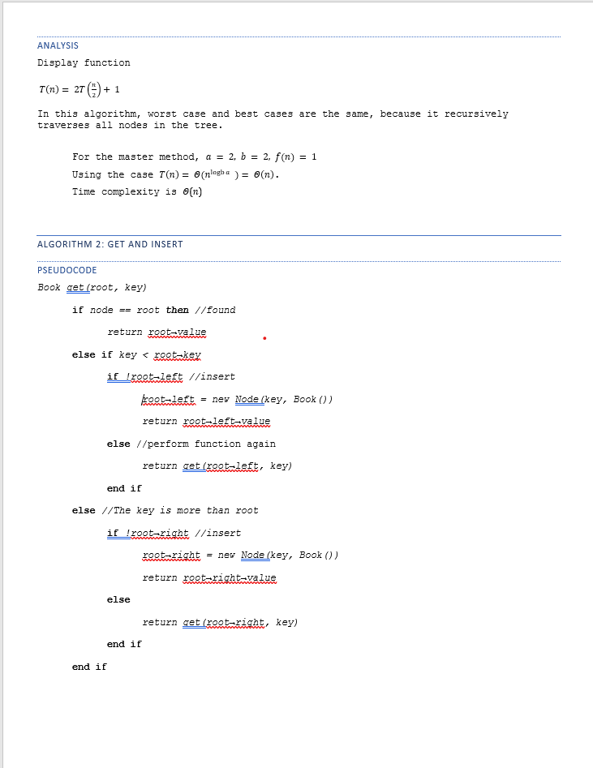
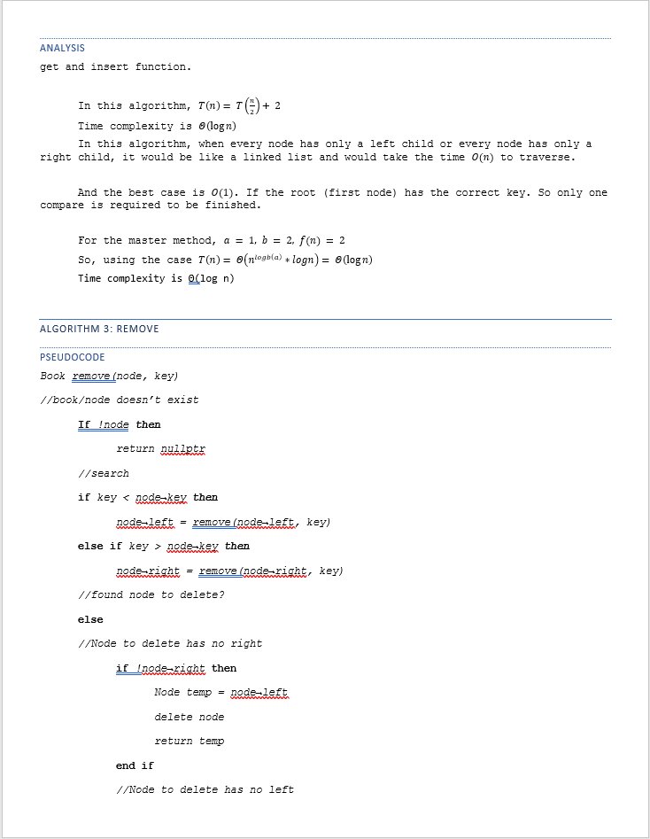
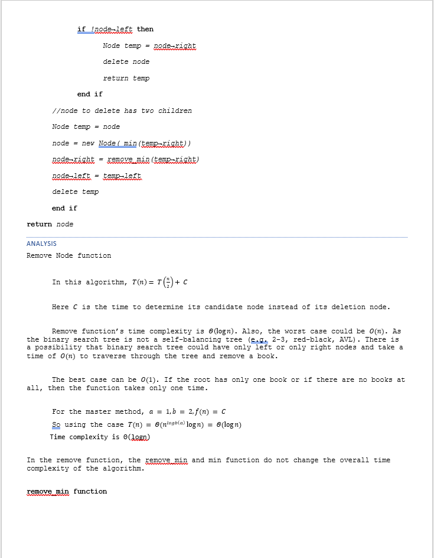
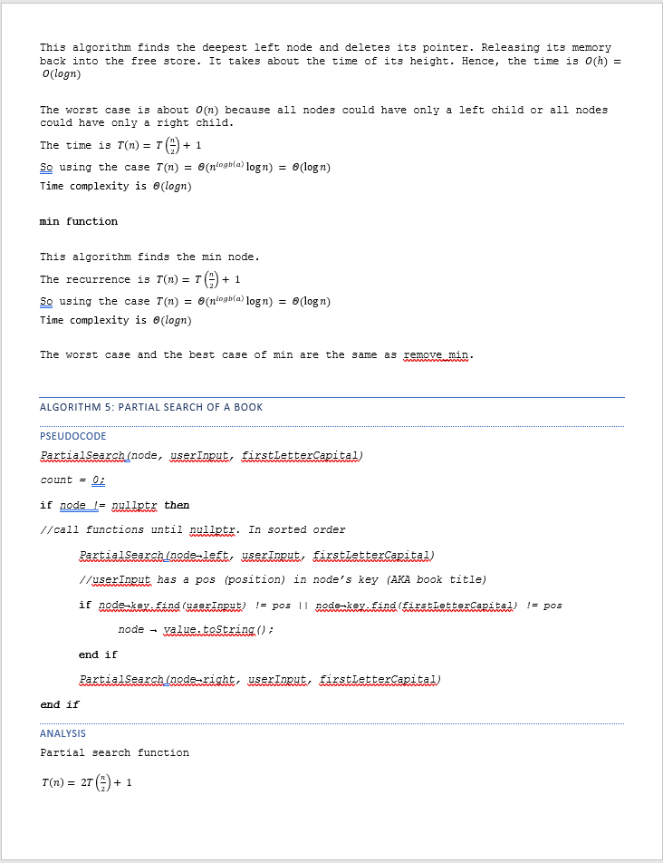
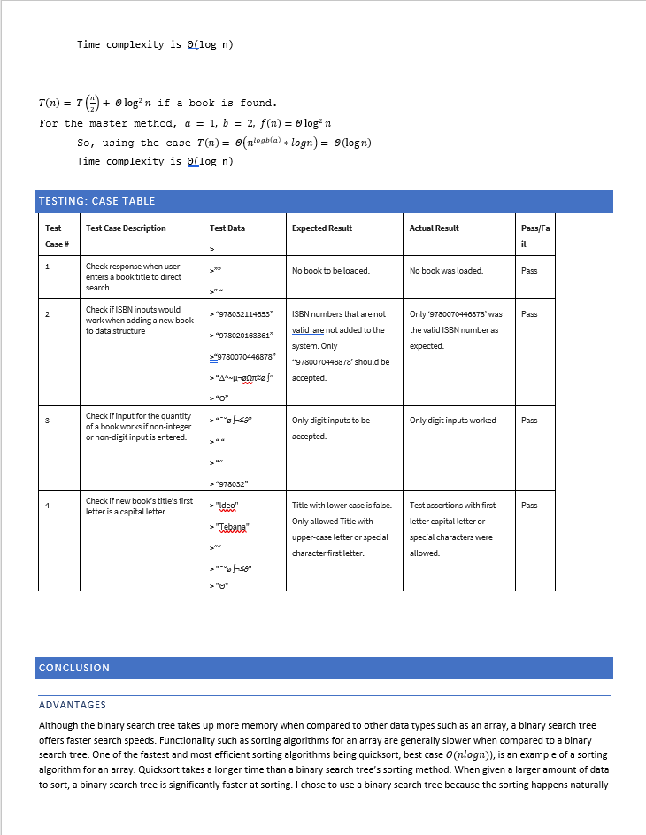
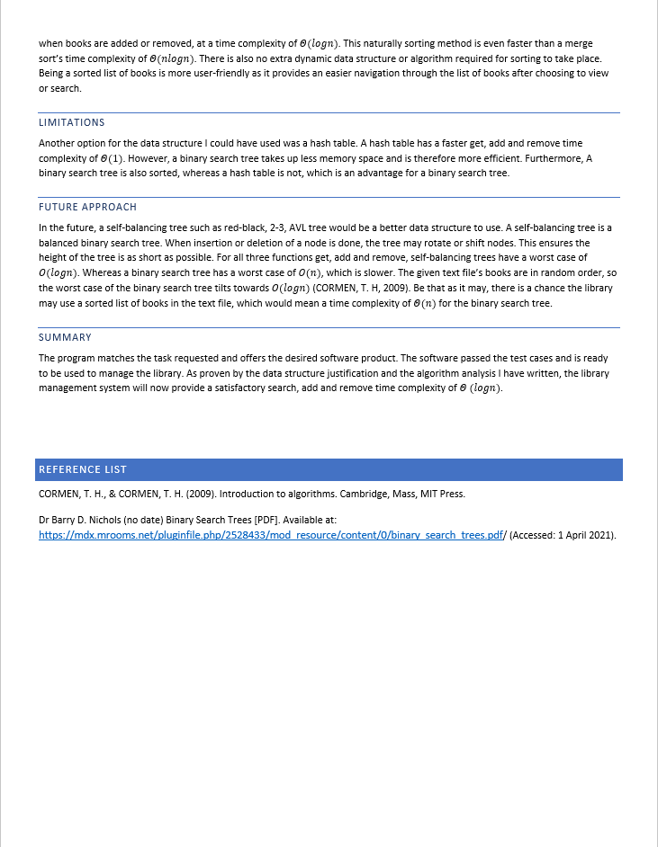

Program presents the User with a recurring console-based menu to interact with the data set. Application consists of some ‘dummy’ data of books pre-coded into the application in the 'books.txt' file.
  
<h4>Below I have demonstrated how to run the application and the console-based program's prompt.</h4>
  &emsp;&emsp; 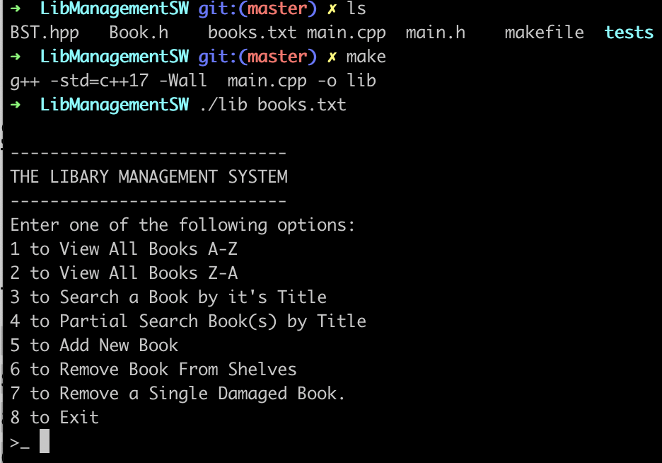

  The User can simply exit the program by entering eight. The seven other menu options allow the User to inspect and edit the information in the data set (note again that this program allows the user to read and write the data).
  
  <h4>Below are images of the necessary interactions of the program with respect to the options mentioned above.</h4>

  
- <h5>Add/Search a Book by it's Title</h5>
  
  &emsp;&emsp; 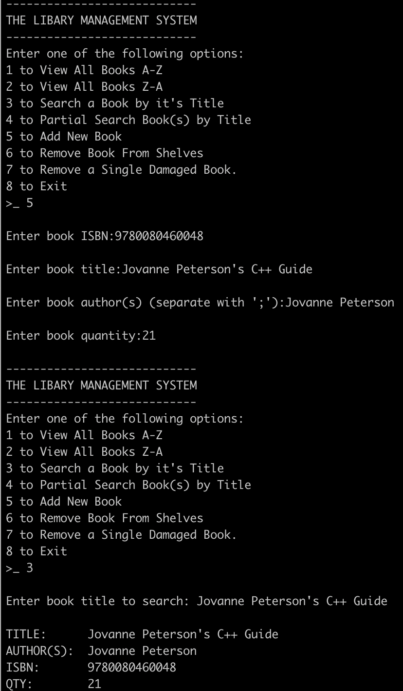

- <h5> Partial Search a Book</h5>
  
  &emsp;&emsp; 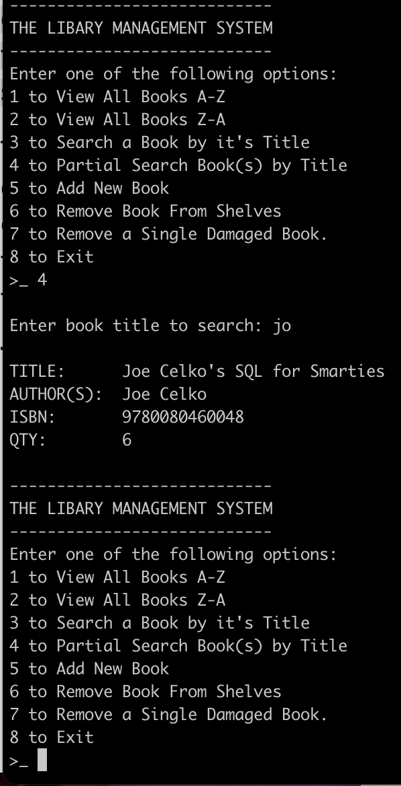
  
- <h5>Completely Remove a Book </h5>
  
  &emsp;&emsp; 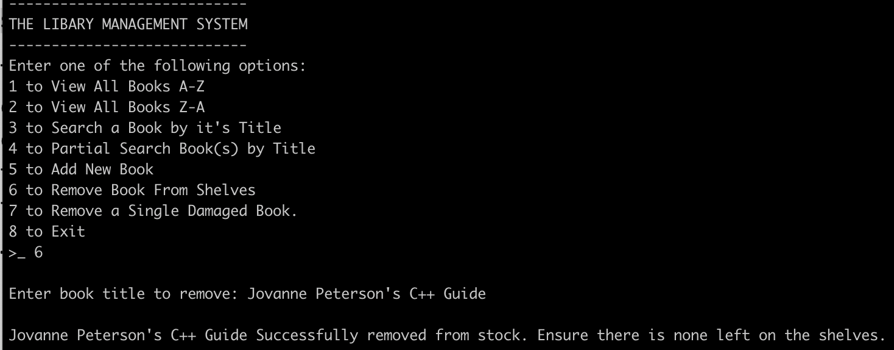
